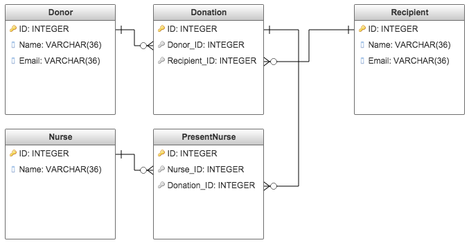

# Blood Donor Management System

People donate blood every day. To ensure that the blood is trasferred safely, both recipients, and donors go through a checklist with a nurse. The checklist covers things that could introduce bloodborne diseases to the recipients, and to validate the bloodtype compatibility. In the rare case that a disease has no symptoms during the checklist, but is contagious by blood, the recipient could receive blood that is infected. This system allows for the notification, and tracking of all recipients that could be affected by that donor.

### Database

* Donor, a person who donated blood
* Recipient, a person who received blood
* Donation, the transaction of blood, involves 1 donor, and 1 recipient
* Nurse, a nurse who was present in the donation process
* PresentNurse, the relationship between nurses and donations, involves 1 nurse and 1 donation

### Design

* Donor has many Donations, Recipients through Donations
* Recipient has many Donations, Donors through Donations
* Donation belongs to Donors and Recipients, has many Nurses through PresentNurses
* Nurse has many PresentNurses, Donations through PresentNurses
* PresentNurse belongs to Donations and Nurses

### Environment

* Ruby version: 2.3.0p0

* Database: sqlite3, rails db:create, and rails db:seed, or rails db:reset

* Testing: rails t
